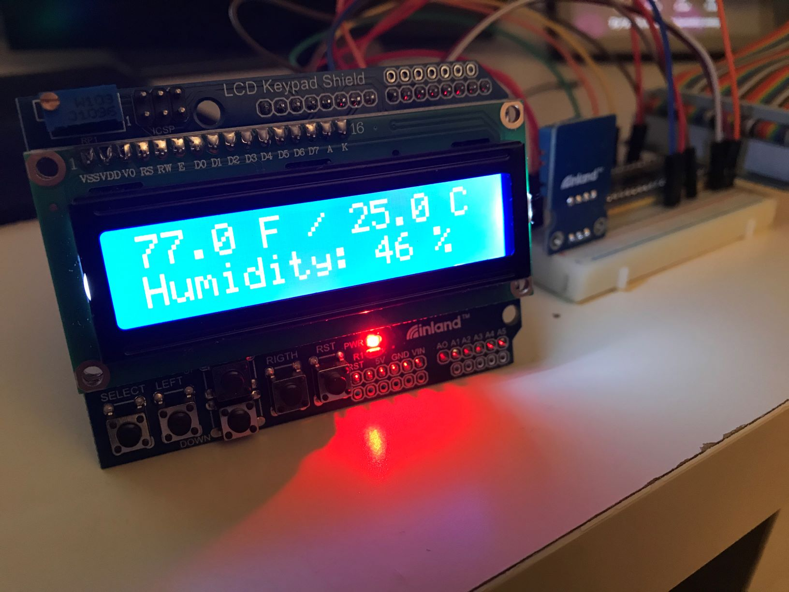

# thermometer_v2
Built a digital thermometer with Raspberry Pi 4, DHT11 sensor and a 16x2 lcd as Practise of Python

Oof, hardware wiring is harder than expected.

But here it is, an image of a thermometer version 2's prototype:

Next step will be building a small api on this raspberry pi to send environmental data, with python of course.

