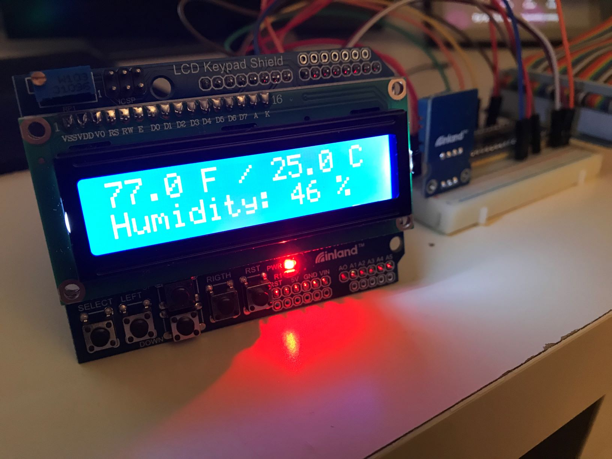
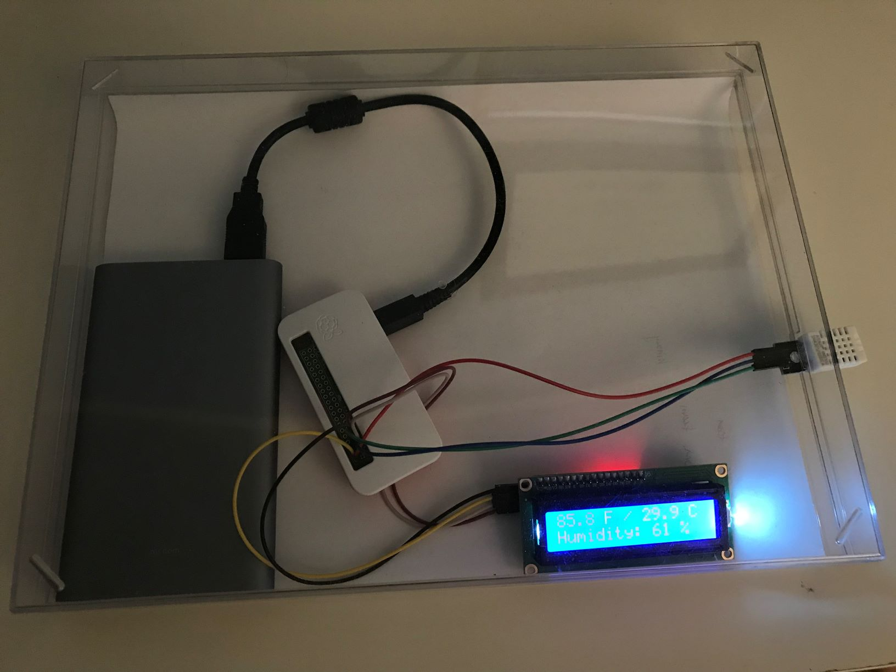
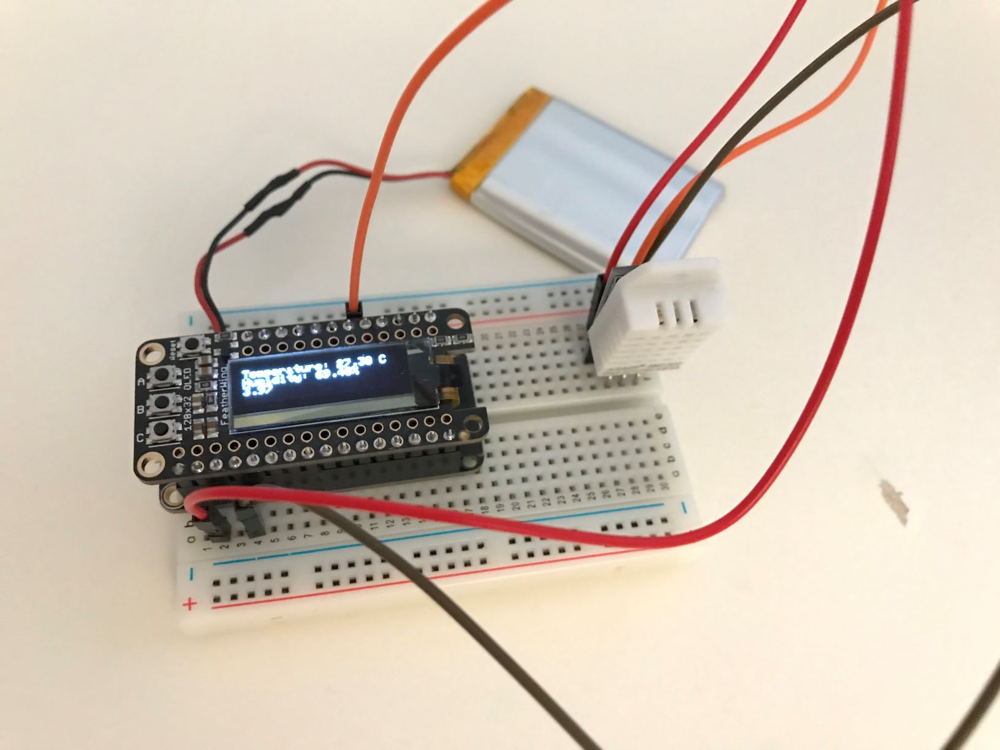

# thermometer_v2
Built a digital thermometer with Raspberry Pi 4, DHT11 sensor and a 16x2 lcd as Practise of Python.

hardware wiring is harder than expected, But here it is, a photo of the thermometer version 2's prototype:



And here is a battery-powered version of v2 built on Raspberry Pi Zero W:

After that, I detoured a little bit to the ESP32 microcontroller of which firmware is written in C++

These are all environmental data gathering points. All of them have wireless capability. They will be gathering temp/humi data for my later projects.
<br>
<br>
package needed
```
sudo apt-get install libgpiod2
sudo pip3 install adafruit-circuitpython-dht rplcd
```